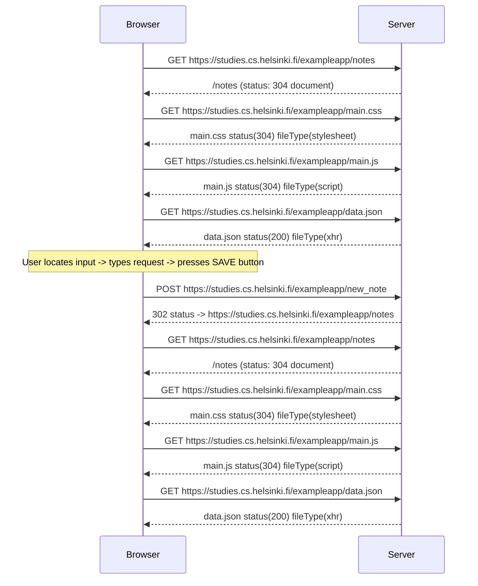

Exercise 0.4

```mermaid
sequenceDiagram
    participant Browser
    participant Server

    Browser->>Server: GET https://studies.cs.helsinki.fi/exampleapp/notes
    Server-->>Browser: /notes (status: 304 document)
    
    Browser->>Server: GET https://studies.cs.helsinki.fi/exampleapp/main.css
    Server-->>Browser: main.css status(304) fileType(stylesheet)
    
    Browser->>Server: GET https://studies.cs.helsinki.fi/exampleapp/main.js
    Server-->>Browser: main.js status(304) fileType(script)
    
    Browser->>Server: GET https://studies.cs.helsinki.fi/exampleapp/data.json
    Server-->>Browser: data.json status(200) fileType(xhr)
    
    Note over Browser: User locates input -> types request -> presses SAVE button
    
    Browser->>Server: POST https://studies.cs.helsinki.fi/exampleapp/new_note
    Server-->>Browser: 302 status -> https://studies.cs.helsinki.fi/exampleapp/notes
    
    Browser->>Server: GET https://studies.cs.helsinki.fi/exampleapp/notes
    Server-->>Browser: /notes (status: 304 document)
    
    Browser->>Server: GET https://studies.cs.helsinki.fi/exampleapp/main.css
    Server-->>Browser: main.css status(304) fileType(stylesheet)
    
    Browser->>Server: GET https://studies.cs.helsinki.fi/exampleapp/main.js
    Server-->>Browser: main.js status(304) fileType(script)
    
    Browser->>Server: GET https://studies.cs.helsinki.fi/exampleapp/data.json
    Server-->>Browser: data.json status(200) fileType(xhr)
```

