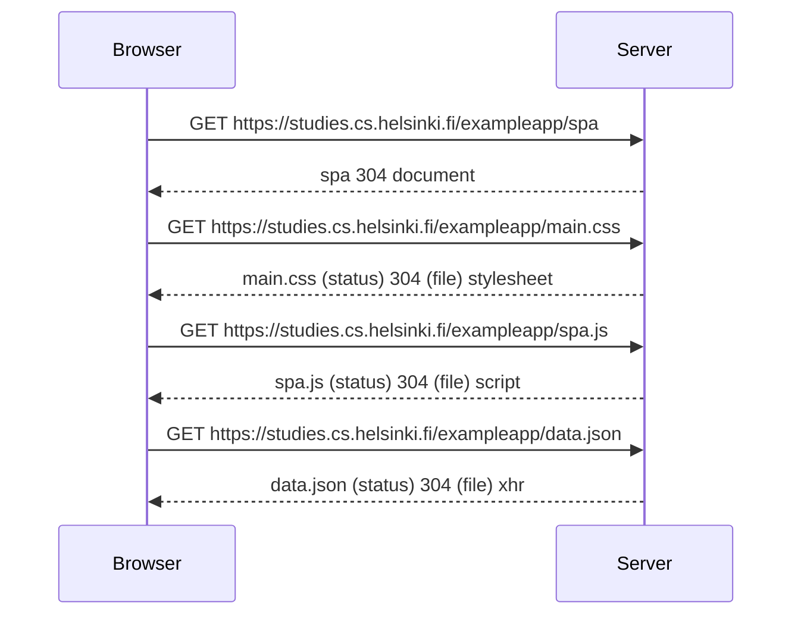

```mermaid
sequenceDiagram
    participant Browser
    participant Server

Browser->>Server: GET https://studies.cs.helsinki.fi/exampleapp/spa
Server-->>Browser:spa	304	document
Browser->>Server: GET https://studies.cs.helsinki.fi/exampleapp/main.css
Server-->>Browser: main.css	(status) 304	(file) stylesheet
Browser->>Server: GET https://studies.cs.helsinki.fi/exampleapp/spa.js
Server-->>Browser: spa.js	(status) 304	(file) script
Browser->>Server: GET https://studies.cs.helsinki.fi/exampleapp/data.json
Server-->>Browser: data.json	(status) 304	(file) xhr
```
